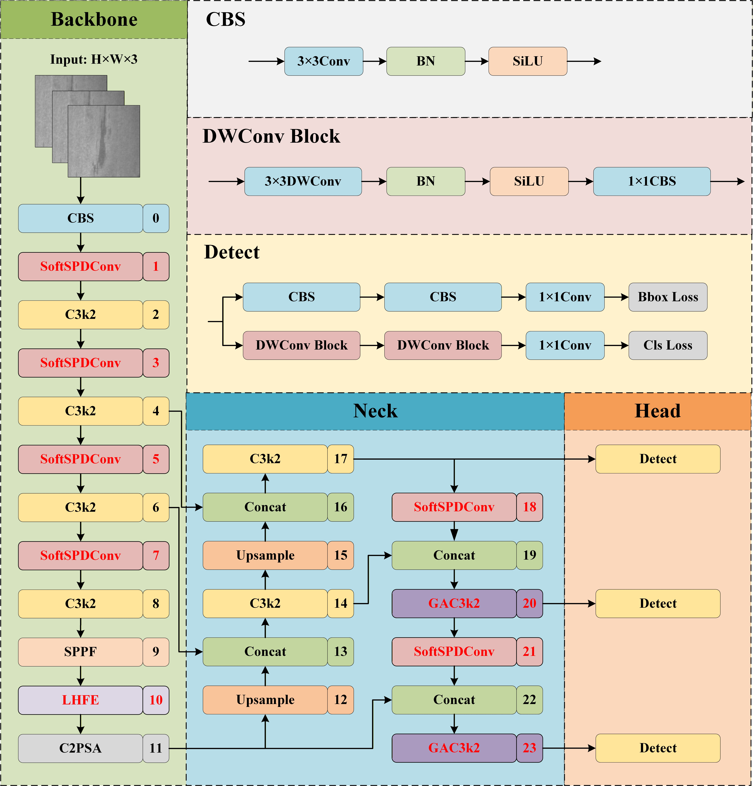

# SLG-YOLO: A Lightweight Network for Steel Surface Defect Detection Based on YOLOv11
This is the official code of SLG-YOLO.
## SLG-YOLO

## code

### Setup

	conda create -n SLG-YOLO python=3.9
	conda activate SLG-YOLO
	pip install torch==2.8.0 torchvision==0.23.0 torchaudio==2.8.0 --index-url https://download.pytorch.org/whl/cu128
	pip install ultralytics

### Train SLG-YOLO
``python train.py --dataset /path/to/dataset.yaml --epochs 300 --batch 16 --imgsz 640 ``
### Test SLG-YOLO
``python test.py --image /path/to/image.jpg --save_path /path/to/save/results --model_weights /path/to/your/model/weights/best.pt ``
## Concat
For any question, feel free to email [619085557@qq.com](mailto:619085557@qq.com) (B. Hu).
## Ackowlegements
We would like to thank the developers of [YOLO](https://github.com/ultralytics/ultralytics) for their open-source contributions, which greatly supported the development of our work.